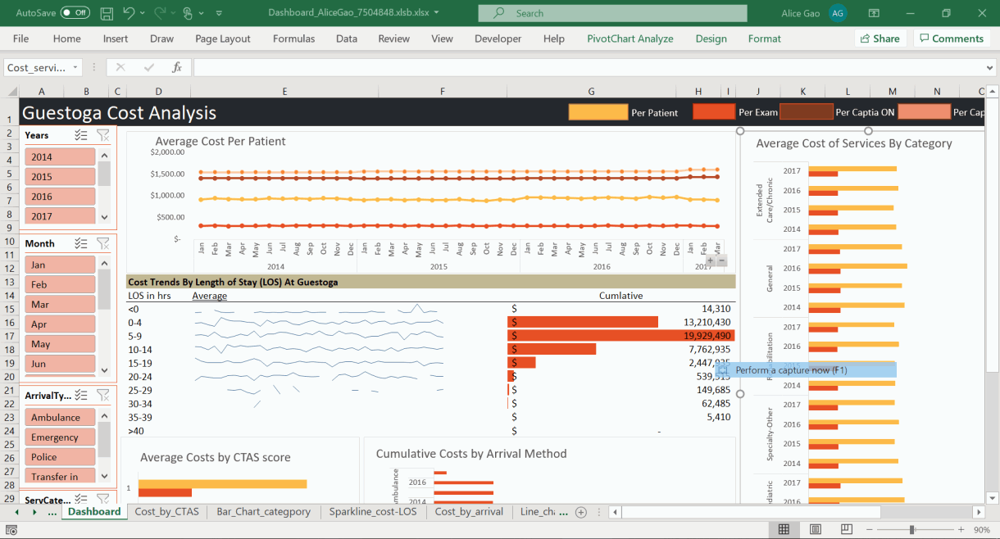

<H1>Excel Database- Cost analysis</H1>

This is a dashboard based on ED visits to a fictional GUESTOGA hospital. For the project we were given a portion of the database containing all patient encounter details from 2014-2017. For my project I chose cost analysis at a high level (i.e. CFO) as the dashboard theme.
 

In terms of cost- the original Excel presented only partial data- like the unit cost of each type of encounter and how many encounters of that type there were for each patient specific visit. Based on the partial data provided, I calculated the total cost of each patient per visit, and per year. Cleaning the data to draw a comparison to CIHI data.
 

To view the excel file yourself- download all 4 dashboard zip files and select all and right click to extract (this is a rather large file that I had to split for Github’s upload stipluations). Or alternatively, you can download it at this google doc <a href="https://drive.google.com/open?id=1rLujRRQ7Tr6gxN16Q00wqxMopTANBaUc”>link</href>

<H2>Disclaimer</H2>
All data was is fake. There has been no real personal information used in the creation and population of fields in this excel dashboard.

